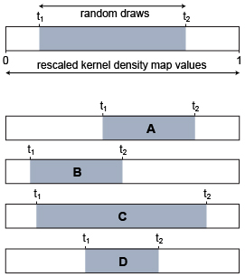

# OccurrenceThinner

OccurrenceThinner is a Java program that aims to reduce geographical sampling bias in occurrence records. It takes a set of species occurrence records and a kernel density grid (illustrated in figure) as input. It then filters out occurrence records using a probability-based procedure. The probability that any specific occurrence record is removed is proportional to the density of occurrence records in the area as defined by the kernel density grid. Information about the algorithm is provided in the user guide below.

Note that while distance-based thinning can improve models in some cases, this may not always be the case. In fact, by applying this procedure you may be throwing away useful data when regions of dense sampling coincide with steep ecological gradients over short geographic distances. This will of course depend on your specific dataset.



### User guide

OccurrenceThinner is a command-prompt program to be run in a terminal window. To open a terminal window, start the Terminal program (Mac OS X) or the Command Prompt (Windows). You will also have to install the Java Runtime Environment for your platform.

You need two input files to run the program: a file with input coordinates and a raster with kernel density values. The kernel density raster needs to be produced with other software. We use either the Kernel Density function in the Spatial Analyst extention for ArcGIS or the bkde2D function in the R package KernSmooth to generate it. These kernel density functions calculate a magnitude per unit area from point features using a kernel function to fit a smoothly tapered surface to each point. Other users have reported using kernel density maps from GRASS GIS.

The input coordinates should be in csv (comma-separated values) format. This is a file with species' geographic coordinates just like you use for Maxent runs. The first line (column headers) must clearly indicate "latitude" and "longitude". OccurrenceThinner assumes that all the occurrences in the file are from the same species. If you have multiple species, make separate csv files and run OccurrenceThinner separately for every species.

Put your input files and the OccurrenceThinner.jar file in the same folder. Then open the terminal window and navigate to that folder using the cd command (click for more info). Type `java -jar occurrenceThinner104.jar` and press Enter to run the program. This will show the command-line parameters that you need to specify for your run (also listed below).

Now add the necessary flags to run the program on your data. To run the parameters with default parameter values, simply specify the input coordinates and kernel density raster. Suppose your file with occurrence records is called occurrences.csv and your kernel density raster file is kerneldensity.asc, then you need to type `java -jar occurrenceThinner104.jar -i occurrences.csv -r kerneldensity.asc` and press Enter. You should avoid having spaces in your filenames. If you do, replace them with underscores. If you wish to use non-default parameter settings, also specify any of the optional parameters listed below.

The program will filter occurrence records based on the kernel density at the coordinates of the occurrence records, omitting more occurrence records from densely sampled regions. To accomplish this, the kernel density map is first rescaled between 0 and 1. Then, the program will run through all occurrence records and decide whether or not to retain them one by one. Whether the record is retained is decided with a random draw. That is, a random draw is made between t1 and t2, which are values that can be set with the -t1 and -t2 flags. If the random draw exceeds the kernel density at the pixel in which the occurrence record is situated, the occurrence record will be kept. If it is smaller, it will be removed. Thus, by setting t1 and t2 you can manipulate the amount of thinning that is done and hence the number of occurrence records that is retained.


The figure above illustrates the procedure and how setting t1 and t2 affect the results. First, look at the top of the figure. Suppose that for a given point, the kernel density function is high. This means that the random draw will often be smaller than the kernel density function and the point will be discarded. Similarly, if you imagine a low density function at a point, random draws will often exceed the kernel density and the point will be kept. Manipulating t1 and t2 allows you to tweek the output to fit your needs. In scenario A, you will draw random points from the upper half of the 0-1 range, which means that draws are more likely to exceed the kernel density values and more points will be kept. Scenario B draws random points from the lower half of the 0-1 range and more points will be discarded. Having white space left of t1 means that values in the range from 0 to t1 are automatically retained. Similarly, having white space right of t2 means that values in the range from t2 to 1 are automatically discarded. The distance between t1 and t2 can thus be used to manipulate how much of the points are removed or included a priori instead of decided on by random draws. In scenario C, the region of random draws spans almost the entire 0-1 range, meaning that few points will be discarded or included a priori. In scenario D, almost all points are automatically included (below t1) or excluded (above t2) and only points in between t1 and t2 are decided on by random draw.

Here is a complete list of command-line flags you can use.

```
mandatory parameters
   -i   input coordinates (csv)
   -r   kernel density raster (esri ascii format)

optional parameters
   -nr  number of replicate thinnings to be produced (default 10)
   -t1  threshold 1 (value between 0 and 1; default 0)
   -t2  threshold 2 (value between 0 and 1; default 1)
```

### Citation
If you find this software useful, please cite it in your work. I recommend citing it as follows:
Verbruggen H. (2012) OccurrenceThinner version 1.04. https://github.com/hverbruggen/OccurrenceThinner

I also recommend citing the first paper that used and described the technique implemented here:
Verbruggen H., Tyberghein L., Belton G.S., Mineur F., Jueterbock A., Hoarau G., Gurgel C.F.D. & De Clerck O. (2013) Improving transferability of introduced species' distribution models: new tools to forecast the spread of a highly invasive seaweed. PLoS One 8: e68337.

### Notes and disclaimer
OccurrenceThinner is in development and has not been tested extensively. It is quite plausible that incorrectly formatted input could lead to nonsensical output. In such cases, you should double-check your input, compare it to the example files and try again. If this still doesn't work, please feel free to write me an email (heroen.verbruggen@gmail.com).

